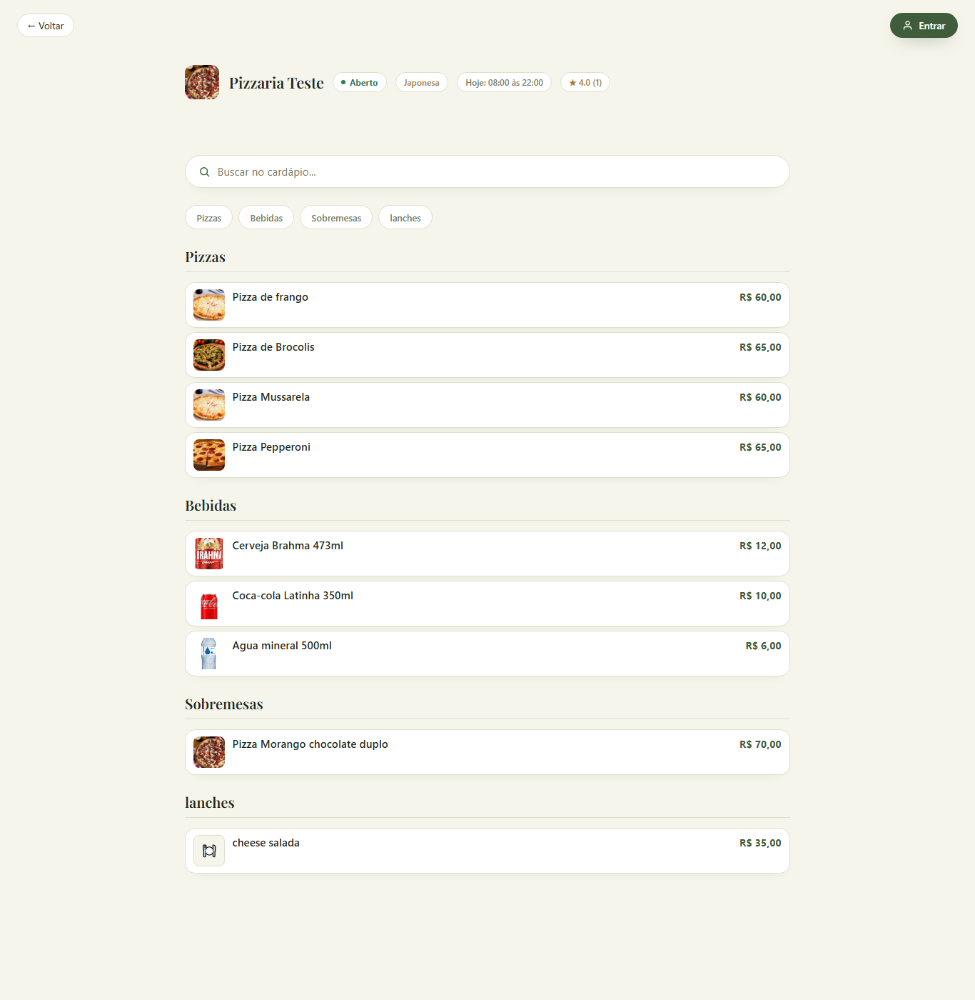
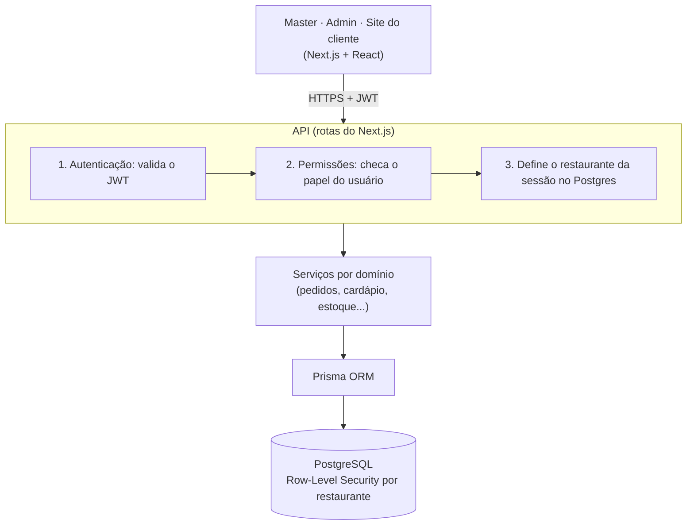
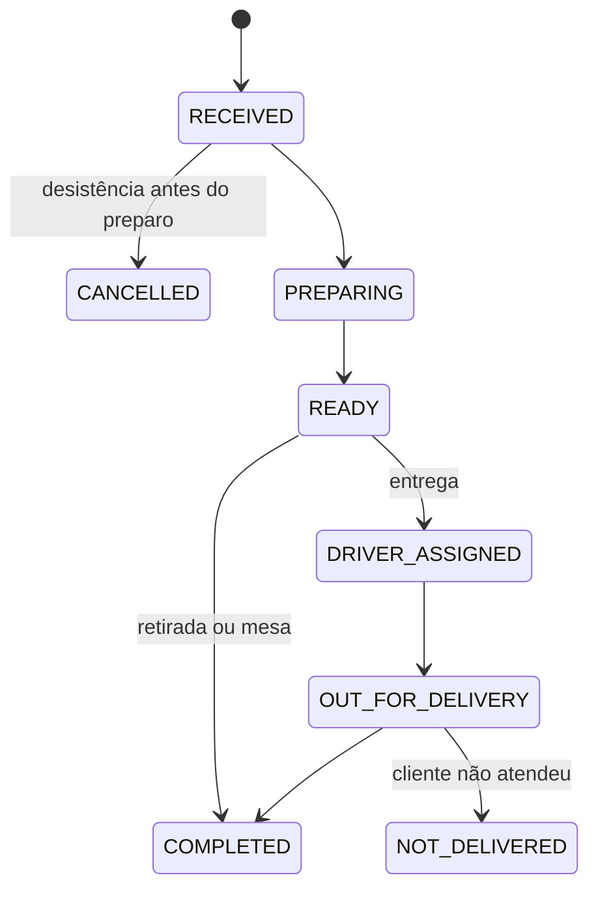
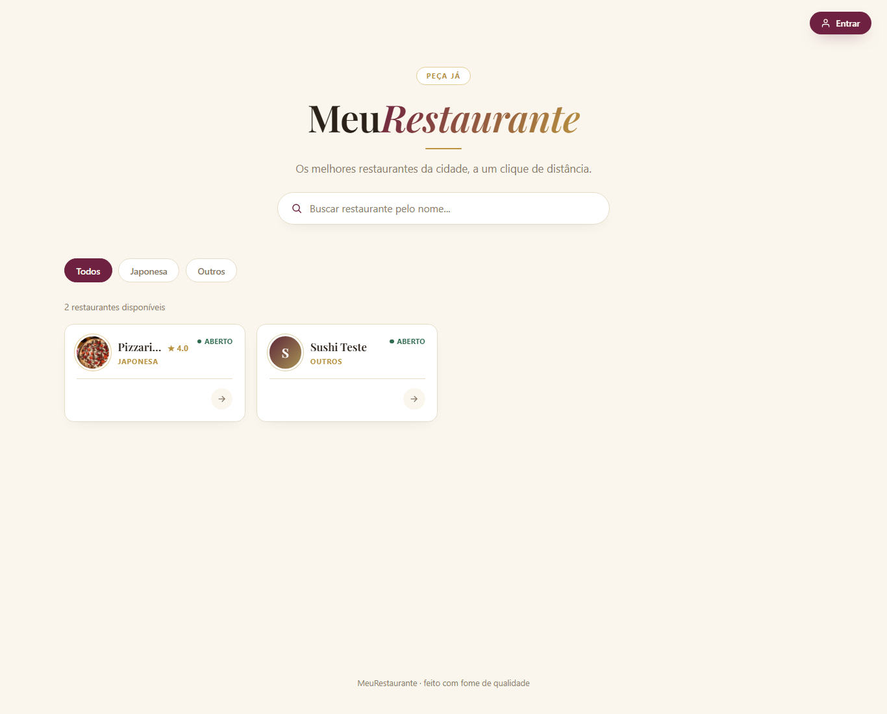

# MeuRestaurante — Plataforma SaaS de gestão de restaurantes

Plataforma web multiempresa que desenvolvi sozinho, do banco de dados à interface, e que está em produção. Um único sistema atende vários restaurantes, cada um com seu painel de gestão e seu site de pedidos, com os dados de cada restaurante isolados no próprio banco.

**Site de pedidos ao vivo:** https://meurestaurante-five.vercel.app · [cardápio de exemplo](https://meurestaurante-five.vercel.app/r/pizzaria-teste)

> O código-fonte é privado, porque o sistema é um produto em desenvolvimento para uso comercial. Este repositório documenta a arquitetura e as decisões técnicas. Posso mostrar o código em uma entrevista.

## As três frentes

| Frente | Quem usa | O que faz |
| --- | --- | --- |
| **Master** | Dono da plataforma | Cria, suspende e reativa restaurantes, com log de auditoria |
| **Admin** | Restaurante e funcionários | Cardápio, pedidos, cozinha, entregadores, compras e estoque, financeiro, cupons, usuários |
| **Site do cliente** | Consumidor final | Cardápio público por restaurante, carrinho, checkout, acompanhamento do pedido, chat e avaliação |

## Números

- **29 tabelas** no PostgreSQL, com **41 migrations** versionadas
- **80 rotas de API**, organizadas em **15 módulos** de negócio: auth, tenant, restaurant, catalog, orders, customers, delivery, drivers, inventory, purchases, finance, coupons, fiscal, notifications, geocoding

## Arquitetura

Monolito modular em TypeScript: o front-end e a API ficam no mesmo projeto Next.js, e as regras de negócio ficam em módulos separados por domínio.

### Isolamento entre restaurantes com Row-Level Security

A decisão mais importante do projeto. Todas as tabelas de negócio têm `restaurant_id`, e uma política de **Row-Level Security** do PostgreSQL faz cada consulta enxergar só as linhas do restaurante da sessão. Mesmo que um bug na aplicação esqueça um filtro `WHERE`, o banco não devolve dados de outro restaurante.

- A aplicação conecta ao banco com um usuário **sem permissão de ignorar a RLS**; só as migrations usam o usuário dono do schema.
- O restaurante nunca vem do corpo da requisição: é sempre lido do JWT.
- Um **teste automatizado roda contra um Postgres real** (não um mock) e prova que o usuário do restaurante A não lê nem altera dados do restaurante B.

Alternativas avaliadas e descartadas: um banco por restaurante e um schema por restaurante, porque cada migration precisaria rodar N vezes.

### Pedidos

São três tipos de pedido: entrega, retirada e consumo no local. Todos seguem a mesma máquina de estados, com cada mudança registrada em histórico:

O total do pedido é sempre **calculado no servidor**; o valor enviado pelo navegador é ignorado, para impedir que alguém altere o preço na requisição.

### Segurança

- Login com JWT e três papéis: `SUPER_ADMIN`, `RESTAURANT_ADMIN` e `STAFF`, este com abas liberadas por permissão
- Senhas com hash (bcrypt)
- Limite de tentativas no login contra força bruta
- Validação das entradas da API com Zod

## Funcionalidades do painel do restaurante

- **Cardápio:** categorias, produtos, grupos de adicionais e pizza meio a meio
- **Pedidos e cozinha:** fila em tempo real, observações em destaque e status por etapa
- **Entrega:** entregadores, taxa de entrega por faixa de distância (km), busca de endereço por CEP
- **Compras e estoque:** fornecedores, insumos, fichas técnicas (composições), pedidos de compra com recebimento e alerta de estoque baixo
- **Financeiro:** relatórios de vendas e cupons de desconto
- **Fiscal:** perfis fiscais dos produtos
- **Clientes:** cadastro, endereços, chat com o cliente e avaliações

Os requisitos de compras, insumos e cadastro fiscal foram levantados com pessoas do ramo de restaurantes.

## Tecnologias

| Camada | Tecnologias |
| --- | --- |
| Front-end | Next.js (App Router), React, TypeScript, CSS Modules, Leaflet (mapas) |
| Back-end | Rotas de API do Next.js, Zod, JWT, bcrypt |
| Banco de dados | PostgreSQL com Row-Level Security, Prisma ORM |
| Testes | Vitest, com testes de integração contra Postgres real |
| Infraestrutura | Docker Compose (ambiente local), Vercel (produção), Vercel Blob (imagens) |
| Ferramentas | Git, ESLint, Claude Code como assistente de programação |

## Autor

**Théo Monteiro** · Estudante de Sistemas de Informação na PUC-Campinas
[LinkedIn](https://www.linkedin.com/in/th%C3%A9o-monteiro-2782983a9/) · [GitHub](https://github.com/theomont7)
