# MeuRestaurante — Plataforma SaaS de gestão de restaurantes

Plataforma web multiempresa que desenvolvi sozinho, do banco de dados à interface, e que está em produção. Um único sistema atende vários restaurantes, cada um com seu painel de gestão e seu site de pedidos, com os dados de cada restaurante isolados no próprio banco.

**Site de pedidos ao vivo:** https://meurestaurante-five.vercel.app · [cardápio de exemplo](https://meurestaurante-five.vercel.app/r/pizzaria-teste)

> O código-fonte é privado, porque o sistema é um produto em desenvolvimento para uso comercial. Este repositório documenta as funcionalidades, a arquitetura e as decisões técnicas. Posso mostrar o código eu mesmo.

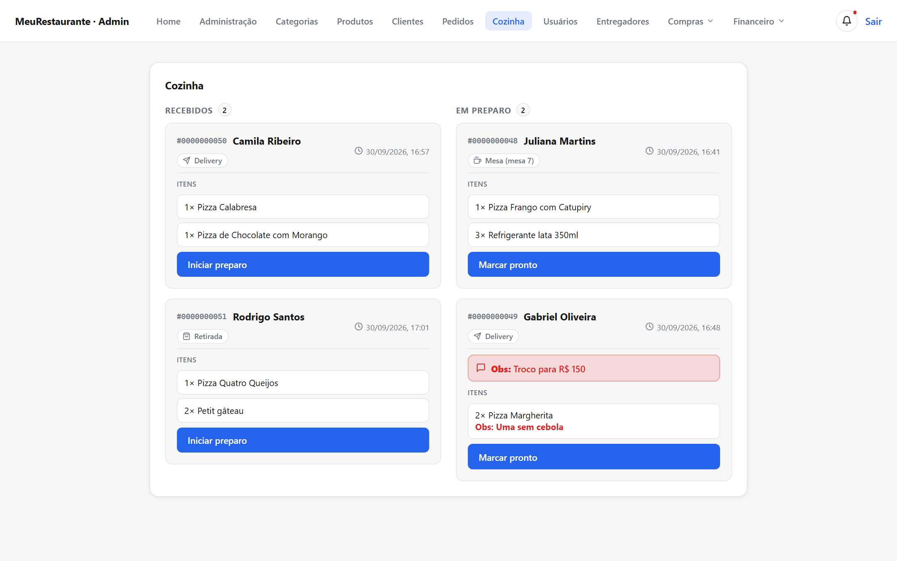

*Os prints do painel usam um restaurante de demonstração com dados fictícios.*

## Sumário

- [As três frentes](#as-três-frentes)
- [Painel do restaurante](#painel-do-restaurante): pedidos, cozinha, cardápio, área de entrega, compras e estoque, financeiro, cupons, equipe, configurações
- [Site do cliente](#site-do-cliente)
- [Painel Master](#painel-master)
- [Arquitetura e decisões técnicas](#arquitetura-e-decisões-técnicas)
- [Tecnologias](#tecnologias)

## As três frentes

| Frente | Quem usa | O que faz |
| --- | --- | --- |
| **Painel do restaurante** | Dono do restaurante e equipe | Toda a operação: pedidos, cozinha, cardápio, entrega, estoque, compras, financeiro |
| **Site do cliente** | Consumidor final | Escolhe o restaurante, monta o pedido, paga e acompanha a entrega |
| **Master** | Dono da plataforma | Cadastra e gerencia os restaurantes que usam o sistema |

**Números do projeto:** 29 tabelas no PostgreSQL, 41 migrations versionadas e 80 rotas de API em 15 módulos de negócio.

## Painel do restaurante

O foco do sistema: é aqui que o restaurante trabalha o dia inteiro.

### Pedidos

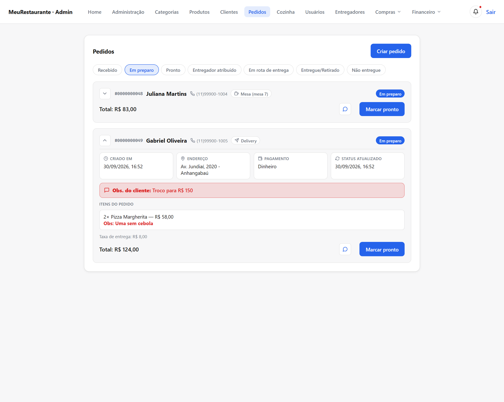

- Pedidos separados por etapa: recebido, em preparo, pronto, entregador atribuído, em rota, entregue/retirado e não entregue.
- Três tipos de pedido: **entrega**, **retirada** no balcão e **consumo no local** (com número da mesa).
- Detalhe de cada pedido: itens com adicionais, observações do cliente em destaque, endereço, forma de pagamento, taxa de entrega e histórico de status.
- **Criação manual de pedidos**, para pedidos feitos por telefone ou no balcão.
- Cancelamento com motivo, registrando se quem cancelou foi o cliente ou o restaurante.
- **Chat com o cliente** dentro de cada pedido:

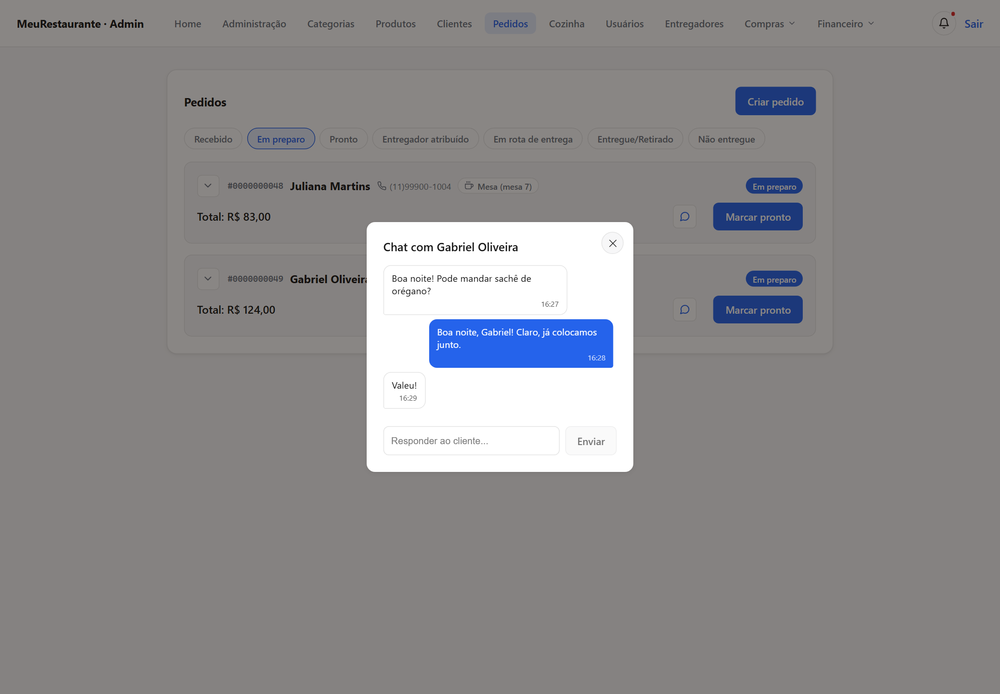

### Cozinha

- Tela própria em colunas, com os pedidos **recebidos** e **em preparo** em ordem de chegada (fila FIFO).
- Observações do pedido e de cada item destacadas em vermelho ("sem cebola", "troco para R$ 150").
- Um clique avança o pedido de etapa; o cliente acompanha a mudança no site.

### Cardápio

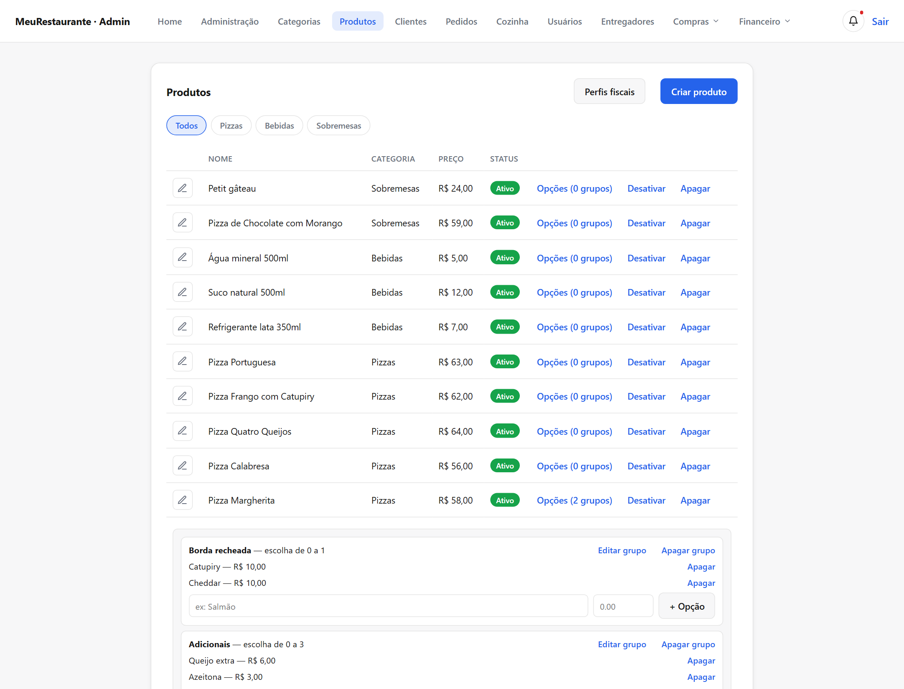

- Categorias e produtos com foto, descrição, preço e ativação/desativação.
- **Grupos de opções** por produto (borda recheada, adicionais, sabores), com mínimo e máximo de escolhas e preço de cada opção.
- **Pizza meio a meio**, liberada por categoria, com adicionais separados para cada sabor.
- **Perfis fiscais** para os produtos.

### Área de entrega

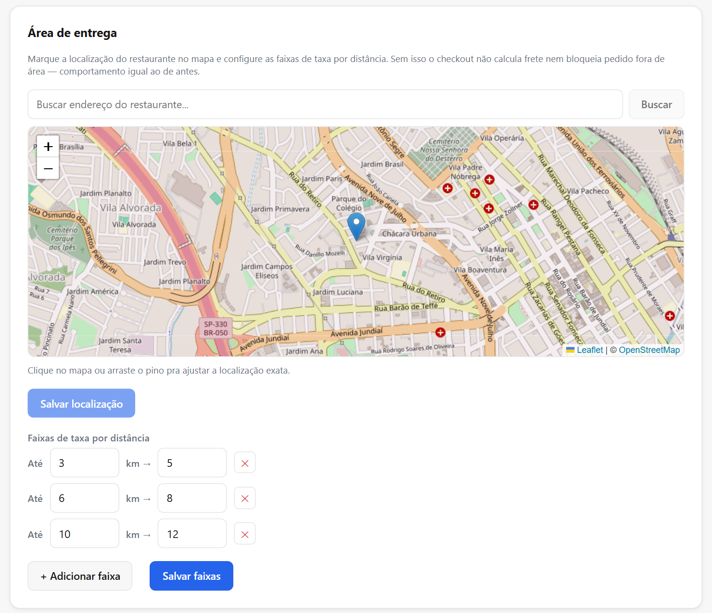

- O restaurante marca a própria localização num **mapa** (Leaflet + OpenStreetMap), buscando o endereço ou arrastando o pino.
- Cadastra **faixas de taxa por distância**: até 3 km, R$ 5; até 6 km, R$ 8; e assim por diante. A maior faixa define o raio de entrega.
- No checkout, o endereço do cliente é convertido em coordenadas (geocodificação via Nominatim), e a distância até o restaurante é calculada pela **fórmula de Haversine**.
- Com isso, o sistema **calcula a taxa de entrega automaticamente** e **bloqueia pedidos fora da área** de entrega.
- Busca de endereço pelo **CEP** (ViaCEP).
- **Entregadores**: cadastro, atribuição do entregador ao pedido e acompanhamento das entregas em rota.

### Compras e estoque

| Insumos com alerta de estoque baixo | Fichas técnicas dos produtos |
| --- | --- |
| 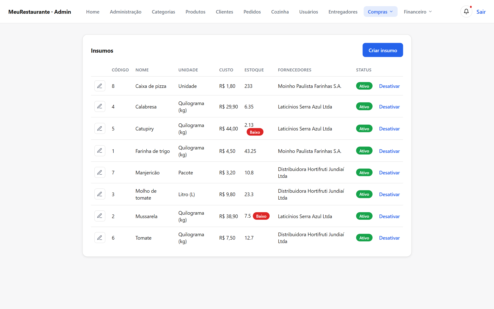 | 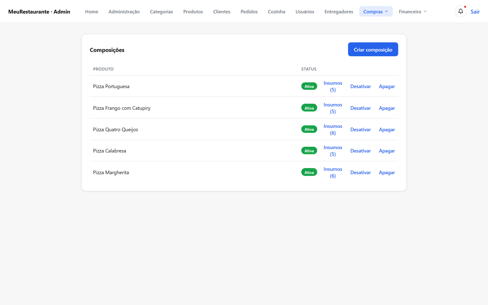 |

- **Fornecedores** e **insumos** (farinha, queijo, embalagens...), com unidade, custo, estoque e fornecedores de cada insumo.
- **Fichas técnicas (composições):** quanto de cada insumo vai em cada produto.
- **Baixa automática de estoque**: cada pedido desconta os insumos da ficha técnica, e um cancelamento devolve os insumos ao estoque.
- **Alerta de estoque baixo** na tela de insumos e no sino de notificações do painel.
- **Pedidos de compra** para os fornecedores, com **recebimento** que dá entrada no estoque, e condições de pagamento (prazo, forma, dia de fechamento).

### Financeiro

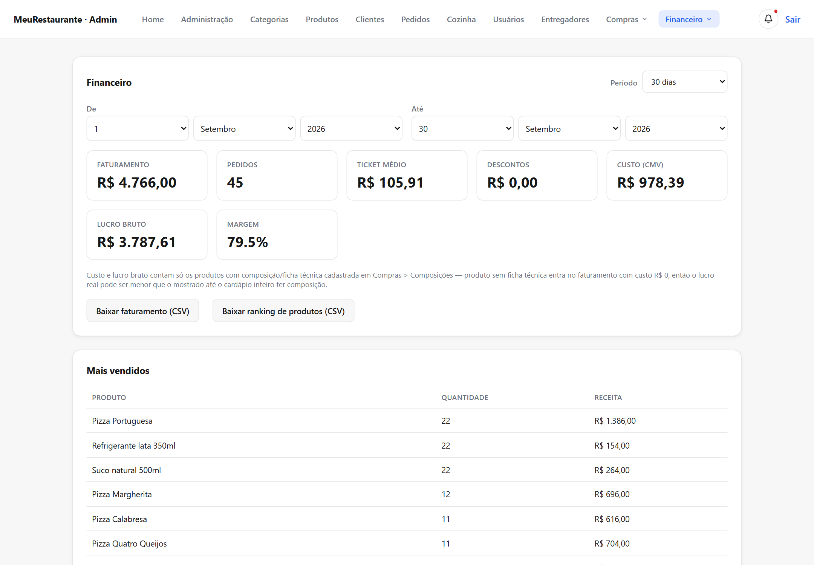

- Faturamento, número de pedidos, ticket médio e descontos do período escolhido.
- **Custo da mercadoria vendida (CMV)**, lucro bruto e margem, calculados a partir das baixas de estoque dos pedidos concluídos.
- Ranking dos produtos mais vendidos.
- Exportação do faturamento e do ranking em **CSV**.

### Cupons de desconto

- Desconto em **porcentagem** ou **valor fixo**.
- Regras: valor mínimo do pedido, limite de usos, uso único por cliente, validade e cupom restrito a um produto.

### Equipe e acesso

- Usuários do restaurante com dois papéis: **administrador** e **funcionário**.
- O funcionário tem login próprio e acesso só às abas liberadas para ele (cozinha, produtos, entregadores).
- Suspensão e reativação de acesso, e recuperação de senha por e-mail.

### Configurações do restaurante

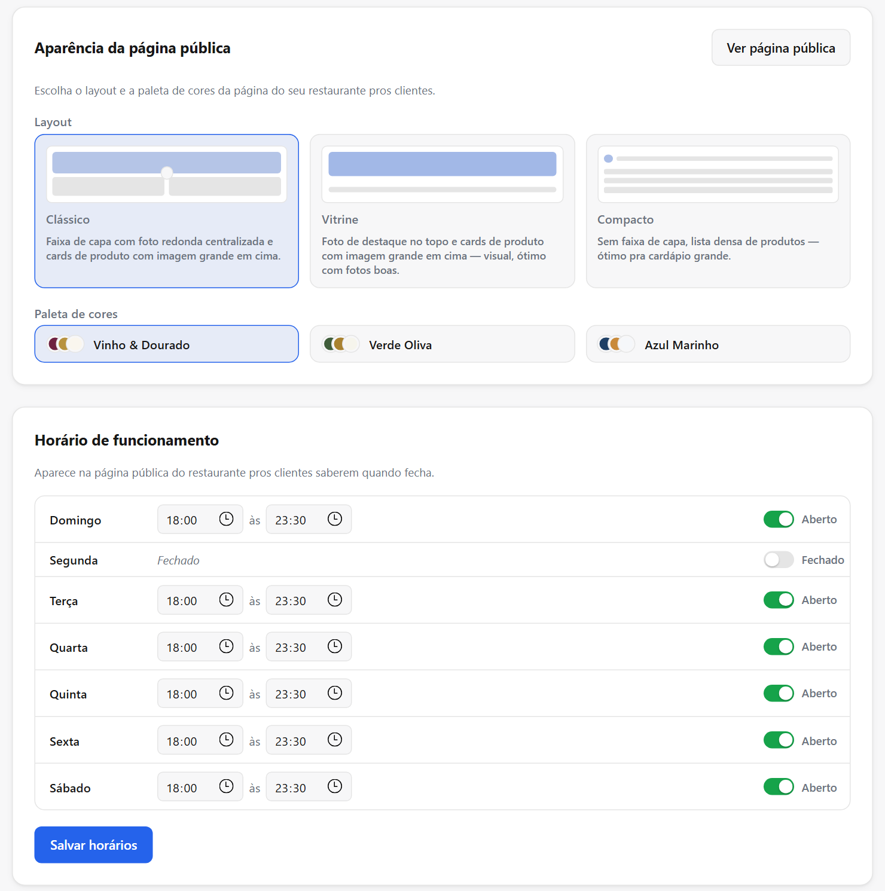

- **Identidade:** nome, foto e tipos de cozinha (usados como filtro no site).
- **Aparência da página pública:** três layouts (Clássico, Vitrine e Compacto) e três paletas de cores.
- **Horário de funcionamento** por dia da semana, e botão para abrir ou fechar o restaurante na hora.
- **Dados fiscais** do emitente (regime tributário, inscrições, endereço fiscal com código IBGE do município).

## Site do cliente

| Página inicial | Cardápio |
| --- | --- |
|  |  |

- **Página inicial** com todos os restaurantes, busca por nome, filtro por tipo de cozinha, avaliação média e indicação de aberto/fechado.
- **Cardápio** de cada restaurante com busca, categorias e o layout e as cores escolhidos pelo restaurante.
- **Carrinho** com adicionais, meio a meio, edição de itens e **cupom de desconto**.
- **Checkout** com escolha do endereço salvo, taxa de entrega calculada, forma de pagamento e observações.
- **Conta do cliente:** cadastro e login, vários endereços (com busca por CEP), formas de pagamento salvas, histórico de pedidos e recuperação de senha.
- **Acompanhamento do pedido** com o status atualizado automaticamente, **chat com o restaurante** e **avaliação** depois da entrega.
- **Notificações** no site e **e-mails** a cada etapa do pedido: recebido, pronto, saiu para entrega, concluído, cancelado ou não entregue.

## Painel Master

- Cadastro de novos restaurantes, já criando o primeiro administrador com senha temporária.
- Suspensão e reativação de restaurantes, e **data de expiração** com suspensão automática.
- **Histórico de auditoria** de cada restaurante: quem criou, suspendeu ou alterou.
- Métricas gerais da plataforma.

## Arquitetura e decisões técnicas

Monolito modular em TypeScript: o front-end e a API ficam no mesmo projeto Next.js, e as regras de negócio ficam em módulos separados por domínio.

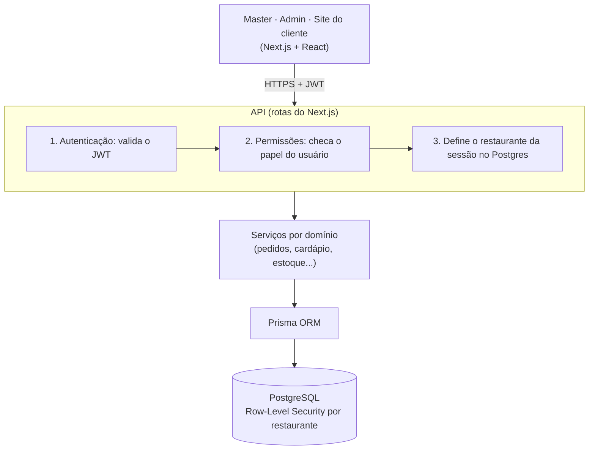

### Isolamento entre restaurantes com Row-Level Security

A decisão mais importante do projeto. Todas as tabelas de negócio têm `restaurant_id`, e uma política de **Row-Level Security** do PostgreSQL faz cada consulta enxergar só as linhas do restaurante da sessão. Mesmo que um bug na aplicação esqueça um filtro `WHERE`, o banco não devolve dados de outro restaurante.

- A aplicação conecta ao banco com um usuário **sem permissão de ignorar a RLS**; só as migrations usam o usuário dono do schema.
- O restaurante nunca vem do corpo da requisição: é sempre lido do JWT.
- Um **teste automatizado roda contra um Postgres real** (não um mock) e prova que o usuário do restaurante A não lê nem altera dados do restaurante B.

Alternativas avaliadas e descartadas: um banco por restaurante e um schema por restaurante, porque cada migration precisaria rodar N vezes.

### Ciclo do pedido

Os três tipos de pedido seguem a mesma máquina de estados, com cada mudança registrada em histórico:

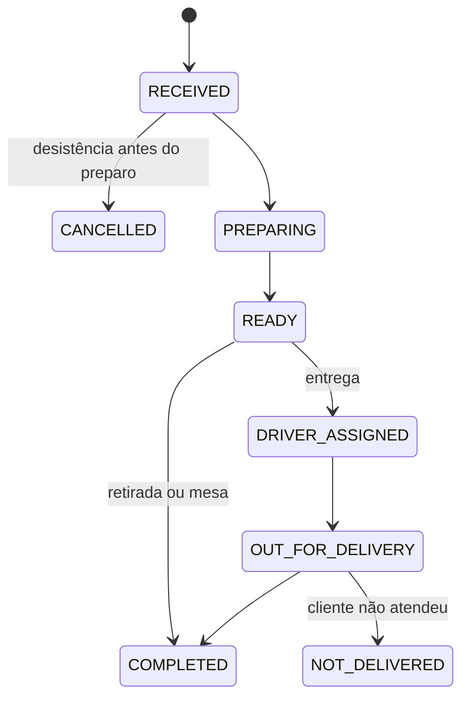

- O total do pedido é sempre **calculado no servidor**; o valor enviado pelo navegador é ignorado, para impedir que alguém altere o preço na requisição.
- A criação do pedido, o histórico de status, a baixa de estoque e o uso do cupom acontecem **na mesma transação** do banco: ou tudo é gravado, ou nada.
- **Concorrência tratada:** o número do pedido vem de um incremento atômico que trava a linha do restaurante, então dois pedidos simultâneos nunca recebem o mesmo número; e cupons com limite de usos ou de uso único são revalidados dentro da transação, para dois clientes não usarem a última unidade ao mesmo tempo.

### Segurança

- Login com JWT e três papéis: `SUPER_ADMIN`, `RESTAURANT_ADMIN` e `STAFF`
- Senhas com hash (bcrypt)
- Limite de tentativas no login contra força bruta
- Validação das entradas da API com Zod

## Tecnologias

| Camada | Tecnologias |
| --- | --- |
| Front-end | Next.js (App Router), React, TypeScript, CSS Modules, Leaflet |
| Back-end | Rotas de API do Next.js, Zod, JWT, bcrypt |
| Banco de dados | PostgreSQL com Row-Level Security, Prisma ORM |
| Serviços externos | OpenStreetMap/Nominatim (mapas e geocodificação), ViaCEP (CEP), e-mail transacional |
| Testes | Vitest, com testes de integração contra Postgres real |
| Infraestrutura | Docker Compose (ambiente local), Vercel (produção), Vercel Blob (imagens) |

Os requisitos de compras, insumos e cadastro fiscal foram levantados com pessoas do ramo de restaurantes.

## Autor

**Théo Monteiro** · Estudante de Sistemas de Informação na PUC-Campinas
[LinkedIn](https://www.linkedin.com/in/th%C3%A9o-monteiro-2782983a9/) · [GitHub](https://github.com/theomont7)
